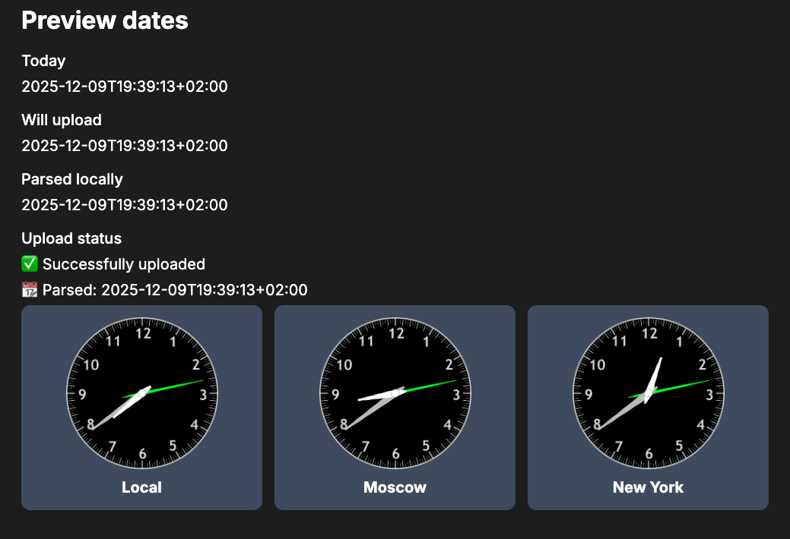

# Timezone Flow

This repo shows how to respect date`s timezone using ``dayjs`` library.

## Preview


## Run app
```shell
docker compose up
```
_After successful build app will be available at http://localhost:3000_

## Stop the app
```shell
docker compose stop
```
